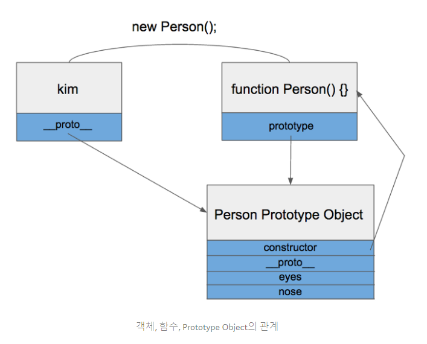

# 프로토 타입
## 프로토 타입
- 자바스크립트는 기존의 객체를 복사해서 새로운 객체를 생성하는 프로토타입 기반의 언어

## 프로토타입 객체
- 함수가 정의될때 기본적으로 Constructor가 부여됨
- constructor를 가지면 new 연산자를 사용할수있음
- constructor, __proto__를 가지고 있음
- constructor는 정의된 함수를 가리키고 있다.
- new 연산자로 생성된 객체의 __proto__ 정의된 함수의 prototype Object를 가리킨다.


## 프로토타입 링크
- __proto__ 

## 프로토타입 체이닝
- __proto__ 속성을 통해 상위 프로토타입과 연결되어있는 형태
- 탐색시 __proto__가 null이면 탐색을 종료한다.
- 객체의 특정 프로퍼티를 읽으려고 할때, 프로퍼티가 해당 객체에 없는 경우 프로토타입 체이닝이 발생함.

## 프로토타입 상속
- new 생성자
    - 부모의 함수로 새로운 객체를 생성
    - 자식함수의 prototype을 부모 객체로 설정
    - 이 방법으로 할 경우 자식의 constructor가 깨진다.
- Object.create 생성자 (작동 위임 / delegation)
    - 프로퍼티 초기화가 번거롭다.
    ```
        // Object.create 내부 동작
        Object.create = function(obj) {
            function Ghost() {}
            Ghost.prototype = obj;
            return new Ghost();
        }
    ```
- new와 Object.create의 결합
    - protype을 Object.create()로 설정
    - constructor를 다시 살려놓는다.

- 연결형 상속
    - Object.assign을 통해 구현함
    - JQuery, lodash등 .extend()와 비슷
- 함수형 상속
    - 새 속성들을 연결형 상속으로 쌓되 상속 기능을 Factory 함수로 만들어 사용함
    - 객체 확장에 함수를 사용하는 큰 이점은 Private Data를 클로저를 통해 캡슐화 시킬수 있음

- es6 class 상속
    - 기존 prototype 기반의 상속과 다를게 없음
    - class를 사용한 상속은 결과는 하나지만 prototype을 사용한 상속은 방법이 여러개이다.
    
## for...of, for...in
### for...of
    - 이터러블한 객체의 순회를 도와주는 반복문
    - Symbol.iterator를 가진 객체만 가능
    - 일반 Object는 불가능
### for...in
    - Object의 key를 순회하기 위해 사용되는 반복문
    - 단, 상속의 경우 상위의 오브젝트도 모두 순회함
    - 숨겨진 객체 속성중 [[Enumerable]]이 true로 표시되어있기때문에 속성키들만 반복적으로 순회가 가능함