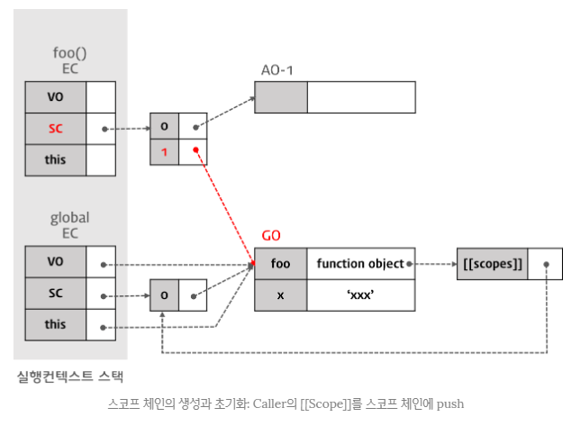

# 스코프

## 스코프
- 변수가 영향을 미치는 범위
- 선언시 스코프가 결정 (호출이 아님)

## 스코프 체인
- 자신의 상위 스코프를 참조하는 매커니즘
- 상위의 상위의... 스코프를 체인처럼 꼬리를 물고 있는 형태

## 함수형 / 블록 스코프

### 함수형 스코프
- 함수 내에 선언된 변수가 영향을 미치는 범위
- var로 선언된 변수는 함수 스코프를 갖는다.

### 블록 스코프
- 블록내에 선언된 변수가 영향을 미치는 범위
- let, const 블록 스코프를 갖는다.

### 렉시컬 스코프
- 렉시컬 스코프는 함수를 어디서 호출하는지가 아니라 어디에 선언하였는지에 따라 결정된다.
- 자바스크립트는 렉시컬 스코프를 따르므로 함수를 선언한 시점에 상위 스코프가 결정된다.
- 함수를 어디에서 호출하였는지는 스코프 결정에 아무런 의미를 주지 않는다.

## 함수
### 선언형
    ```
        function square(number) {
            return number * number;
        }
    ```
### 표현식
    ```
        const square = function(number) {
            return number * number;
        }
    ```

## 호이스팅
- 변수 및 함수의 선언을 최상단으로 올리는 것 (var로 선언된 경우)
- 변수 값 할당 및 초기화의 경우 코드의 위치에서 그래도 실행됨
- 실행 컨텍스트 때문에 호이스팅이 발생함
    - 변수선언
    - 변수 초기화
    - 변수에 사용자가 지정한 값으로 초기화
        - 해당 실행 컨텍스트의 변수 객체 생성이 완료된 뒤에 발생함
    - 함수 선언문인지 표현식인지에 따라 생성 과정이 나뉨
        - 선언문
            - 함수선언,초기화,사용자 지정값으로 초기화 모두 발생함
        - 표현식
            - 익명함수를 생성하여 변수에 할당하는 식이기 때문에 변수 호이스팅이 발생
            - 사용자가 지정한 값으로 초기화를 거치지 않고 호출되는 경우 에러 발생

## 실행 컨텍스트
    - 자바스크립트 엔진이 코드를 실행하기 위해 필요한 정보
        - 변수
        - 함수선언
        - 변수의 유효범위 (스코프)
        - this
    - 컨텍스트
        - 전역 컨텍스트
            - 특정 함수안에서 실행되는 코드가 아니라면 전역 컨텍스트에서 실행됨
            - window(전역컨텍스트) 생성
            - this = window로 할당함
        - 함수 컨텍스트
            - 함수는 자신만의 실행컨텍스트를 갖는다.
            - 함수가 호출되어야지만 생성됨

## 클로저
- 외부 환경을 기억하고 있는 함수
- 생성된 함수는 scopes프로퍼티를 갖고 있기때문에 외부 함수가 소멸하여도 scopes 프로퍼티가 가리키는 외부함수의 실행환경을 기억할수있다.


## let
- ES6에 추가됨
- 선언후 재할당이 가능함

## const
- 선언시 할당이 진행되어야함

## Temporal Dead Zone
- let, const로 선언된 변수들에 접근시 에러가 발생함
- Scope에 들어간 시점과 변수에 선언된 시점 사이에 접근할 수 없는 주기


# 실행컨텍스트
- 실행가능한 코드에 대한 추상적인 개념

| `실행컨텍스트` | 
|:---|
`Variable Object`|
`Scope Chain`|
`thisValue`|


VO는 아래의 정보를 갖는다.
| `Variable Object (VO / 변수객체)` | 
|:---|
`변수`|
`매개변수(Parameter) & 인자(Arguments)`|
`함수선언(표현식은 제외)`|

VO의 경우 전역 컨텍스트와 함수 컨텍스트의 경우 동작이 조금 다르다.
- 전역 컨텍스트
    - VO는 유일한 최상위에 위치
    - 모든 전역변수, 전역 함수등을 포함하는 전역 객체를 가리킨다.
- 함수 컨텍스트
    - VO는 AO(Activate Object / 활성객체)를 가리킨다.
    - 매개변수와 인자의 정보를 배열에 담고 있는 객체인 arguments object가 추가됨


## 스코프체인
- 해당 전역 또는 함수가 참조할 수 있는 변수, 함수선언등의 정보를 담고 있는 전역, 활성 객체의 리스트를 가리킨다.
- 변수를 검색하는 매커니즘
- 함수실행중에 변수를 만나면 현재 Scope 즉, 활성객체를 검색함
- 검색이 실패하면 스코프체인에 담겨진 순서대로 검색을 실행
- [[SCOPE]] 프로퍼티를 통해 스코프 체인을 참조할수 있음

## this
호출 패턴에 따라 this값이 변경됨

## 실행컨텍스트 생성 과정

## 예
```
    var x = 'xxx';

    function foo () {
        var y = 'yyy';

        function bar () {
            var z = 'zzz';
            console.log(x + y + z);
        }

        bar();
    }

    foo();
```

1. 전역코드에 진입
1.1 GO(Global Object)가 생성됨
1.2 전역실행컨텍스트 생성 및 스택에 push
1.3 스코프체인의 생성과 초기화
1.4 변수 객체화 실행
1.5 this 값 결정

1.3 스코프체인의 생성과 초기화


1.4 변수 객체화 실행
- 변수,매개변수,arguments,함수선언을 VO에 추가하여 객체화
    - 변수 객체화 순서
    1. arguments가 VO의 프로퍼티로 arguments가 값으로 설정 (Function Code인 경우)
    2. 대상 코드 내의 함수 선언(함수표현식 제외)을 대상으로 함수명이 VO의 프로퍼티로, 생성된 함수 객체가 값으로 설정됨 (함수 호이스팅)
    3. 대상 코드 내의 변수 선언을 대상으로 변수명이 VO의 프로퍼티로, undefined가 값으로 설정됨 (변수 호이스팅)
- 전역 코드의 경우 VO는 GO를 가리킨다.

1.4.1 함수 foo의 선언 처리
- 선언된 함수명 foo가 VO의 프로퍼티로, 생성된 함수 객체가 값으로 설정
    - 생성된 함수 객체는 [[Scopes]]프로퍼티를 가짐
    - 함수 객체만이 소유하는 내부 프로퍼티로서 함수 객체가 실행되는 환경을 가리킨다.
    - 내부 함수의 [[Scopes]] 프로퍼티는 자신의 실행 환경(Lexical Enviroment)과 자신을 포함하는 외부 함수의 실행 환경과 전역 객체를 가리키는데 이때 자신을 포함하는 외부 함수의 실행 컨텍스트가 소멸하여도 [[Scopes]] 프로퍼티가 가리키는 외부 함수의 실행 환경(Activation object)은 소멸하지 않고 참조할 수 있다. 이것이 클로저이다.


1.4.2 변수 x의 선언 처리
    - 변수 처리 단계
        - 선언 단계
            - VO에 변수를 등록. 
        - 초기화 단계
            - 등록된 변수를 메모리에 할당. undefined 초기화
        - 할당 단계
            - undefined로 초기화된 변수에 실제값을 할당 (값을 할당하는 코드를 실행하면 발생)


1.5 this 값 설정
    - this value가 결정되기 이전에 this는 전역 객체를 가리키고 있다가 함수 호출 패턴에 의해 this에 할당되는 값이 결정됨


2. 전역코드의 실행

2.1 변수 값의 할당
- 현재 실행컨텍스트의 스코프체인이 참조하고 있는 VO를 0번째부터 검색하여 변수명에 해당하는 프로피터가 발견되면 값('xxx')를 할당


2.2 함수 foo의 실행
- 전역 코드와 마찬가지로, 스크프체인 생성 및 초기화 -> 변수 객체화 -> this 값 설정 순으로 실행됨, 다만 대상은 전역 코드가 아닌 함수코드가 된다.


2.2.1 스코프 체인 생성 및 초기화
- 함수 코드의 스크프 체인 생성 및 초기화는 AO(Activation Object 활성객체)에 대한 참조를 스크프 체인의 선두에 설정하는것으로 시작
- AO는 우선 arguments 프로퍼티의 초기화를 실행후 변수 객체화를 실행


- 그 후, Caller(전역컨텍스트)의 스코프체인이 참조하고있는 객체가 스코프 체인에 Push됨. 이 경우 함수 foo를 실행한 직후 실행 컨텍스트의 스코프 체인은 Activation Object(함수 foo의 실행으로 만들어진 AO-1)과 전역 객체를 순차적으로 참조하게 된다.


2.2.1 변수 객체화 실행
- Function Code의 경우, 스코프 체인의 생성과 초기화에서 생성된 Activation Object를 Variable Object로서 Variable Instantiation가 실행된다. 이것을 제외하면 전역 코드의 경우와 같은 처리가 실행된다. 즉, 함수 객체를 Variable Object(AO-1)에 바인딩한다. (프로퍼티는 bar, 값은 새로 생성된 Function Object. bar function object의 [[Scope]] 프로퍼티 값은 AO-1과 Global Object를 참조하는 리스트）


- 변수 y를 AO에 설정


2.2.2 this 값 설정
- this는 함수 호출패턴에 의해 결정됨, 내부 함수인 경우 this는 전역객체


2.2.3 foo함수 코드의 실행
- y의 값이 할당됨

2.3 함수 bar의 실행
- bar에 대한 새로운 실행 컨텍스트가 생성됨 foo와 동일한 과정으로 설정됨
- 최종적으로는 아래와 같이 구성됨.

